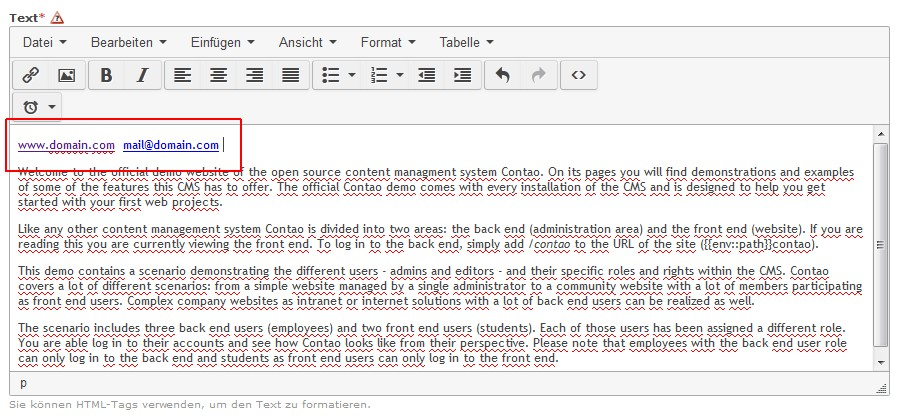

Contao Extension: TinyMceLinkAutoDetect
=======================================

Special TinyMCE plugin that automatically coverts links (e.g. `www.domain.com`) or email addresses (e.g. `mail@domain.com`) into hyperlinks.

The sources of this plugin could be found [here](http://www.tinymce.com/wiki.php/Plugin:autolink).

Now for TinyMCE 4.

Installation
------------

Install the extension via composer: [cliffparnitzky/tiny-mce-link-auto-detect](https://packagist.org/packages/cliffparnitzky/tiny-mce-link-auto-detect).

If you prefer to install it manually, download the latest release here: https://github.com/cliffparnitzky/TinyMceLinkAutoDetect/releases

Tracker
-------

https://github.com/cliffparnitzky/TinyMceLinkAutoDetect/issues

Compatibility
-------------

- min. Contao version: >= 3.3.0
- max. Contao version: <  3.5.0

Dependency
----------

- To load this plugin and add it to the configuration the extension [[TinyMcePluginLoader]](https://github.com/cliffparnitzky/TinyMcePluginLoader) has to be installed.

Screenshot
----------

